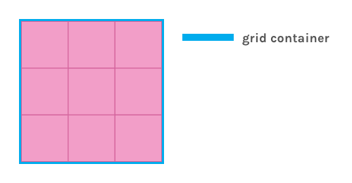
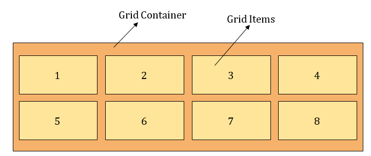
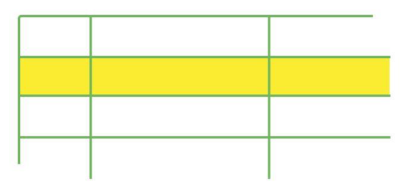
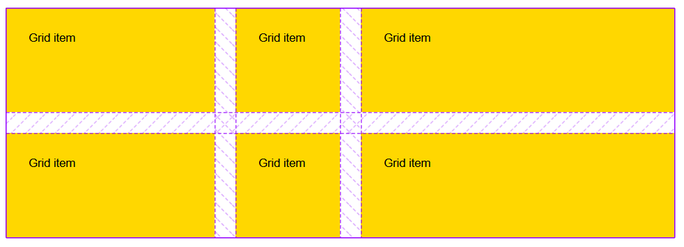
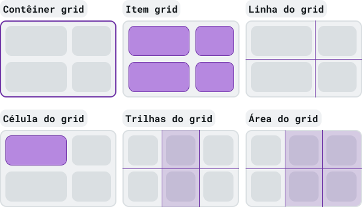

# Grid CSS

- **Sistema de _layout_ bidimensional, baseado em grade;**
  
  - **Recurso do CSS que permite o desenvolvimento de _layouts_ em _grid_ (grade);**
    - **É um valor da propriedade `display`;**
  
- **Trabalha com containers que contém itens;**
  - **O container controla a disposição dos itens, mas os itens também podem alterar os seus próprios posicionamentos;**

- **Os _grids_ são divididos em colunas e linhas;**
  - **Temos um sistema de _layout_ bidimensional, baseado em grade (coleção de linhas horizontais, linhas - _rows_ - e linhas verticais, colunas - _columns_);**

    

    


### Grid-Container

- **Para podermos definir um elemento como um _grid-container_, utilizamos a propriedade `display`, com o valor `grid` (ou o valor `inline-grid`, que torna o elemento em um _grid container_ - porém, com o comportamento `inline`);**

  ```html
  <!DOCTYPE html>
  <html lang="pt-BR">
    <head>
      <meta charset="UTF-8">
      <meta http-equiv="X-UA-Compatible" content="IE=edge">
      <meta name="viewport" content="width=device-width, initial-scale=1.0">
      <title>gridcontainer</title>
        <style>
            .grid-container {
                display: grid;
            }
        </style>
    </head>
    <body>
      <div class="flex-container">
        <div>1</div>
        <div>2</div>
        <div>3</div>
      </div>
    </body>
  </html>
  ```

  - **Automaticamento, todos os filhos diretos do _grid-container_ se tornam _grid-items_;**
  - **Visualmente, não veremos nenhuma diferença, pois é criado uma grade de uma única coluna;**


#### Propriedades do _grid-container_

##### grid-template-columns

- **Define o número total de colunas que serão criadas no _grid_ e as suas respectivas larguras (os valores definem os tamanhos das colunas e os espaços a quantidade de linhas de grade - o mesmo é válido para a propriedade `grid-template-rows`);**

  - **Exemplos:**

    - **Quatro colunas de `100px` de largura, cada:**

      ```css
      grid-template-columns: 100px 100px 100px 100px;
      ```

    - **Duas colunas, sendo a segunda com o dobro da largura da primeira:**

      ```css
      grid-template-columns: 1fr 2fr;
      
      /*
      	- fr: unidade fracional;
      
      	- O tamanho do conteúdo é respeitado, ou seja, se o conteúdo da primeira coluna for 
      	maior que o da segunda, a primeira coluna acabará sendo maior que a segunda;
      */
      ```

    - **Três colunas: a primeira com no mínimo `200px` de largura e no máximo `1fr` e as outras duas colunas com `1fr`:**

      ```css
      grid-template-columns: minmax(200px, 1fr) 1fr 1fr;
      
      /* 
      	- Na primeira coluna, após 200px, ela vai se expandir da mesma forma que as outras colunas;
      */
      ```

    - **Três colunas com `1fr` de largura, cada:**

      ```css
      grid-template-columns: repeat(3, 1fr);
      
      /*
      	- O repeat seria o mesmao que escrever 1fr trẽs vezes;
      */
      ```

    - **Cria, automaticamente, um total de colunas que acomode os itens, com no mínimo `100px` de largura, cada:**

      ```css
      grid-template-columns: repeat(auto-fit, minmax(100px, auto));
      ```
    
    - **Valores, unidades e funções aceitas:**
    
      **- `none`;**
    
      **- `auto`;**
    
      **- `max-content`;**
    
      **- `min-content`;**
    
      **- `px`;**
      
      **- `fr`;**
      
      **- `%`;**
      
      **- minmax();**
      
      **- fit-content();**
      
      **- repeat();**

##### grid-template-rows

- **Define o número total de linhas que serão criadas no _grid_ e as suas respectivas alturas;**

  - **Exemplos:**

    - **Quatro linhas no grid, sendo a primeira com `50px` de altura, a segunda com `100px`, a terceira com `50px` e a quarta com `150px`:**

      ```css
      grid-template-rows: 50px 100px 50px 150px;
      
      /*
      	- Caso o grid necessite de mais linhas, elas terão a altura de acordo com o tamanho do conteúdo;
      */
      ```

    - **Duas linhas no grid, sendo a segunda com uma altura duas vezes maior que a primeira:**

      ```css
      grid-template-rows: 1fr 2fr;
      ```

    
    - **Valores, unidades e funções aceitas:**
    
      **- `none`;**
    
      **- `auto`;**
    
      **- `max-content`;**
    
      **- `min-content`;**
    
      **- `px`;**
      
      **- `fr`;**
      
      **- `%`;**
      
      **- minmax();**
      
      **- fit-content();**
      
      **- repeat();**

##### grid-template-areas

- **Especifica áreas dentro do _layout_;**

  - **Exemplo:**

    - **Cria 3 colunas e 3 linhas:**

      ```css
      /* Cada linha é definida por apóstrofos */
      grid-template-areas:
          'header header header'
          'nav main main'
          'footer footer footer';
      
      /*
      	- header: ocupa a primeira linha, da coluna um, até a coluna três;
      
      	- nav: ocupa a linha e a coluna um;
      
      	- main: ocupa a linha dois e as colunas dois e três;
      
      	- footer: ocupa a terceira linha e as colunas, um, dois e três;
      
      	OBS.: é utilizada em conjunto com a propriedade grid-area, onde nomeamos os grid-itmes e em 
      	seguida, fazemos referência aos nomes dados, na propriedade grid-template-areas;
      */
      ```
    
    - **Também aceita o valor `none`, que indica que o contêiner não define nenhuma área nomeada no _grid_;**
    
    - **OBSs.:**
    
      **- O ponto (`.`) pode ser utilizado para a criação de áreas vazias (representa um _grid-item_ sem nome);**
    
      **- As áreas devem ser retangulares e não podem ser repetidas em locais diferentes;**

##### grid-template

- **_Shorthand_ para as propriedades: `grid-template-columns`, `grid-template-rows` e `grid-template-areas`;**

  - **Exemplos:**

    ```css
    /* grid-template-rows / grid-template-columns */
    grid-template: 100px 1fr / 50px 1fr;
    
    grid-template: auto 1fr / auto 1fr auto;
    
    /* grid-template-areas grid-template-rows / grid-template-column*/
    grid-template:
      'a a a'
      'b b b';
    
    grid-template:
      'a a a' 20%
      'b b b' auto;
    
    grid-template:
        'logo nav nav' 50px
        'sidenav content advert' 150px
        'sidenav footer footer' 100px
        / 100px 1fr 50px;
    ```

    - **Também aceita o valor `none` (valor i), que define o `none` para as três propriedades, indicando que não há uma grade explícita;**

##### gap

- **Define o tamanho das lacunas (espaços) entre as linhas e colunas do _grid_;**

  - **Exemplo:**

    - **`column-gap`: cria espaços entre as colunas;**		

      ```css
      /* Define 20px de distância entre as colunas  */
      column-gap: 20px;
      ```

    - **`row-gap`: cria espaços entre as linhas;**

      ```css
      /* Define 20px de distância entre as linhas */
      row-gap: 20px;
      ```

    - **`gap`: _shorthand_ para as propriedades `row-gap` e `column-gap`;**

      ```css
      /* Define 20px entre os elementos do grid (linha e coluna) */
      gap: 20px;
      
      /* gap: row-gap column-gap; */
      gap: 50px 100px;
      ```
  
  - **OBSs.:**
  
    - **1 - Podemos utilizar valores de qualquer unidade (`px`, `%`, etc.), menos da unidade `fr`;**
  
    - **2 - As propriedades `gap` costumavam ser prefixadas por `grid-`. A especificação mudou, mas é recomendado o uso da versão prefixada, para torna o nosso código menos suscetível a erros;**
  
      ```css
      gap: 20px;
      grid-gap: 20px;
      ```

##### grid-auto-columns

- **Define a largura das colunas geradas no _grid_ implícito (colunas, que não definimos, que são geradas de forma automática);**

  - **Exemplo:**

    ```css
    /* As colunas geradas de forma implícita, terão largua de 100px */
    grid-auto-columns: 100px;
    ```

    - **Valores, unidades e funções aceitas:**

      **- `auto` (padrão);**

      **- `max-content`;**

      **- `min-content`;**

      **- `px`;**

      **- `cm`;**

      **- `vmax`;**

      **- `fr`;**

      **- `%`;**

      **- minmax();**

      **- fit-content();**

##### grid-auto-rows

- **Define o tamanho/altura das linhas do _grid_ implícito (que são geradas automaticamente, em uma linha que não foi definida);**

  - **Exemplo:**

    ```css
    /* As linhas implícitas, geradas automaticamente, terão 100px de altura */
    grid-auto-rows: 100px;
    ```

    - **Valores, unidades e funções aceitas:**

      **- `auto` (padrão);**
      
      **- `max-content`;**
      
      **- `min-content`;**
      
      **- `px`;**
      
      **- `cm`;**
      
      **- `vmax`;**
      
      **- `fr`;**
      
      **- `%`;**
      
      **- minmax();**
      
      **- fit-content();**


##### grid-auto-flow

- **Controla como os _grid-items_, colocados automaticmanete, serão inseridos no _grid_;**

  - **Exemplo:**

    ```css
    /* Gera, automaticamente, novas linhas */
    grid-auto-flow: row;
    
    /* Gera, automaticamente, novas colunas */
    grid-auto-flow: column;
    
    /* 
    	- Tenta posicionar o máximo dos elementos que existirem nas primeiras 
    	partes do grid (pode desorganizar o conteúdo);
    */
    grid-auto-flow: dense;
    ```

    - **Valores, unidades e funções aceitas:**
    
      **- `row` (padrão): coloca os _grid-items_, preenchendo cada linha por vez, adicionando novas linhas conforme necessário;**
      
      **- `column`: coloca os _grid-items_, preenchendo cada coluna por vez, adicionando novas colunas conforme necessário;**
      
      **- `dense`: coloca os _grid-items_ para preencher quaisquer espaços vazios da grade;**
      
      **- `row dense`: coloca os _grid-items_, preenchendo cada linha e cada espaço vazio da grade;**
      
      **- `column dense`: coloca os _grid-items_ preenchendo cada coluna e cada espaço vazio da grade;**

##### grid

- **Shorthand (propriedade abreviada) para as propriedades:**

  - **`grid-template-rows`,**
  - **`grid-template-columns`;**
  - **`grid-template-areas`;**
  - **`grid-auto-rows`;**
  - **`grid-auto-columns`;**
  - **`grid-auto-flow`;**

- **Exemplos:**

  ```css
  /* OBS.: opcional (?) */
  
  grid: none;
  
  /* grid-template-rows  */
  grid: "a" 100px "b" 1fr;
  grid: [linename1] "a" 100px [linename2];
  grid: "a" 200px "b" min-content;
  grid: "a" minmax(100px, max-content) "b" 20%;
  
  /* grid-template-rows / grid-template-columns */
  grid: 100px / 200px;
  grid: minmax(400px, min-content) / repeat(auto-fill, 50px);
  grid: 100px / auto auto auto;
  grid: auto / auto auto auto;
  grid: auto / auto auto;
  grid: 80px 120px / auto auto auto;
  
  /* grid-template-rows / [ auto-flow && dense? ] grid-template-columns? */
  grid: 200px / auto-flow;
  grid: 30% / auto-flow dense;
  grid: repeat(3, [line1 line2 line3] 200px) / auto-flow 300px;
  grid: [line1] minmax(20em, max-content) / auto-flow dense 40%;
  
  /* [ auto-flow && dense? ] grid-auto-rows? /
     grid-template-columns */
  grid: auto-flow / 200px;
  grid: auto-flow dense / 30%;
  grid: auto-flow 300px / repeat(3, [line1 line2 line3] 200px);
  grid: auto-flow dense 40% / [line1] minmax(20em, max-content);
  
  /* 
  	Outras opções (ou formas diferentes de visualização):
  		- grid: grid-template-areas;
  		- grid: grid-template-rows / grid-auto-columns;
  		- grid: grid-auto-rows / grid-template-columns;
  		- grid: grid-template-rows / grid-auto-flow grid-auto-columns;
  		- grid-auto-flow grid-auto-rows / grid-template-columns;
  */
  ```


##### justify-content

- **Justifica toda a grade (todos os _grid-items_), em relação ao eixo horizontal;**
- **Valores:**
  - **`flex-start`/`start`: justifica os _grid-items_ no início;**
  - **`flex-end`/`end`: justifica os _grid-items_ ao final;**
  - **`stretch`: "estica" _grid-items_;**
  - **`space-around`: cria espaçamentos entre cada _grid-item_ (os espaçamentos no meio, acabam sendo maiores do que os espaçamentos no início e no final);**
  - **`space-between`: cria espaçamentos entre os _grid-items_ (ignora o primeiro e o último _grid-item_);**
  - **`space-evely`: cria espaçamentos, de mesma medida, entre as colunas;**
  - **`center`: centraliza o conteúdo;**
- **OBS.: a largura total da grade deve ser menor que a largura do _grid-container_, para que a propriedade `justify-content` tenha efeito;**

##### align-content

- **Alinha toda a grade (todos os _grid-items_) em relação ao eixo vertical;**
- **Valores:**
  - **`flex-start`/`start`;**
  - **`flex-end`/`end`;**
  - **`stretch`;**
  - **`space-around`;**
  - **`space-between`;**
  - **`space-evely`;**
  - **`center`;**
- **OBS.: a altura total da grade deve ser menor que a altura do _grid-container_, para que a propriedade `align-content` tenha efeito;**

##### justify-items

- **Justifica o conteúdo dos _grid-items_ em relação ao eixo horizontal (justifica todos os itens da grade em relação a célula);**
- **Valores:**
  - **`flex-start`/`start`;**
  - **`flex-end`/`end`;**
  - **`center`;**
  - **`stretch`;**

##### align-items

- **Alinha o conteúdo dos _grid-items_ em relação ao eixo vertical (alinhamento de todos os itens da grade é feito em relação a célula);**
- **Valores:**
  - **`flex-start`/`start`;**
  - **`flex-end`/`end`;**
  - **`center`;**
  - **`stretch`;**


### Grid-item

- **Elementos que são filhos diretos de um _grid-container_;**

  

#### Propriedades dos _grid-items_

##### grid-column

- **Define as colunas que o _grid-item_ irá ocupar (a partir das _grid-lines_ verticais: inicial e final);**

  - **É uma _shorthand_ para as propriedades: `grid-column-start` (especifica em qual _grid-line_ vertical, será iniciada a exibição do _grid-item_) e `grid-column-end` (especifica em qual _grid-line_ vertical, deve-se parar a exibição do _grid-item_);**

  - **Exemplos:**
  
    ```css
    /* O grid-item ocupará a primeira coluna */
    grid-column: 1;
    
    /* 
    	O grid-item se estende da linha 1 a linha 3 (grid-lines verticais), ou seja, o grid-item irá ocupar as colunas 1 e 2
    */
    grid-column: 1 / 3;
    
    /* O grid-item irá começar na segunda linha (grid-line vertical) */
    grid-column-start: 2;
    
    /* O grid-item irá terminar na quarta linha (grid-line vertical) */
    grid-column-end: 4;
    
    /* O grid-item irá ocupar duas colunas a partir de onde ele estiver */
    grid-column: span 2;
    
    /* O grid-item irá da primeira linha (grid-line vertical) até o final (a última grid-line vertical)  */
    grid-column: 1 / -1;
    ```
  
    - **OBS.: o `span` é utilizado para especificar quantos espaços de colunas/linhas, o _grid-item_ irá ocupar, a partir da posição em que ele já se encontra;**
  

##### grid-row

- **Define quais linhas o _grid-item_  irá ocupar (a partir das _grid-lines_ horizontais: inicial e final);**

  - **É uma _shorthand_ para as propriedades: `grid-row-start` (define em qual _grid-line_ horizontal, o _grid-item_ irá iniciar) e `grid-row-end` (define em qual _grid-line_ horizontal, a exibição do _grid-item_ irá terminar);**

  - **Exemplos:**
  
    ```css
    /* O grid-item ocupará a primeira linha */
    grid-row: 1;
    
    /* 
    	O grid-item se estende da linha 1 a linha 3 (grid-lines horizontais), ou seja, o grid-item 
    	irá ocupar as linhas (rows) 1 e 2
    */
    grid-row: 1 / 3;
    
    /* O grid-item irá começar na segunda linha (grid-line horizontal) */
    grid-row-start: 2;
    
    /* O grid-item irá terminar na quarta linha (grid-line horizontal) */
    grid-row-end: 4;
    
    /* O grid-item irá ocupar duas linhas (rows) a partir de onde ele estiver */
    grid-row: span 2;
    ```
  


##### grid-area

- **Especifica o tamanho e a localização de um _grid-item_;**

  - **Ela pode ser utilizada para atribuir um nome a um _grid-item_ (os _grid-items_ nomeados, podem então ser referenciados pela propriedade `grid-template-areas`);**

  - **Ela também pode pode ser utilizada como _shorthand_ para: `grid-row-start`, `grid-column-start`, `grid-row-end`, `grid-column-end`;**

    - **Exemplos:**

      ```css
      /*
      	- Atalho para:
      		grid-row-start: 1;
      		grid-column-start: 2;
      		grid-row-end: 4;
      		grid-column-end: 3;
      */
      grid-area: 1 / 2 / 4 / 3;
      
      /* Posiciona o grid-item na área definida como header */
      grid-area: header;
      ```

##### justify-self

- **Justifica o _grid-item_ em relação ao eixo horizontal (justifica um único _grid-item_ em relação ao célula);**
- **Valores:**
  - **`flex-start`/`start`;**
  - **`flex-end`/`end`;**
  - **`center`;**
  - **`stretch`;**

##### align-self

- **Alinha o _grid-item_ em relação ao eixo vertical (alinha um único _grid-item_ em relação ao célula);**
- **Valores:**
  - **`flex-start`/`start`;**
  - **`flex-end`/`end`;**
  - **`center`;**
  - **`stretch`;**


### Grid implícito x Grid explícito

- **O _grid_ explícito, é o grid que nós mesmos criamos, a partir das definições de linhas e colunas, com as propriedades: `grid-template-rows` e `grid-template-columns`, respectivamente;**
- **Porém, coforme mais conteúdo é adicionado, mais linhas e colunas são geradas, de forma automática, além das linhas e colunas que já havíamos definidos;**
  - **Esse caso consiste no _grid_ implícito: quando o conteúdo fica de fora do _grid_ que nós definidos, gerando novas linhas e colunas (criando um "novo _grid_");**
  - **Por padrão, essas novas linhas e colunas são dimensionadas de forma automática (elas possuem tamanho suficiente para acomodar o seu conteúdo);**
  - **Porém, podemos definir tamanhos fixos, para essas novas linhas e colunas, a partir das propriedades: `grid-auto-rows` e `grid-auto-column`, respectivamente;**


### none

- **Valor que indica que não há uma grade explícita;**
- **Logo, qualquer coluna/linha será gerada implicitamente (geradas sem que a gente precise definí-las) e o seu tamanho será determinado pelas propriedades: `grid-auto-columns`/`grid-auto-rows`;**


### min-content && max-content

- **`min-content`: representa o tamanho mínimo que um _container_ pode ter, com base no seu conteúdo, sem que haja o _overflow_  (estouro) em seu conteúdo;**
- **`max-content`: representa o tamanho que um _container_ precisa ter, para conter todo o seu conteúdo sem que haja quebra ou estouro;**

  - **OBS.:**

    - **Quando o _container_ pai não pode acomodar o tamanho do _container_ filho, o _container_ filho tende a _overflow_;**

      ```css
      .container-pai {
          width: 200px;
      }
      
      .container-filho {
          width: max-content;
      }
      ```

    - **Em situações como essa,  é necessário ajustar o conteúdo do _container_ filho, para caber no espaço disponível dele;**

    - **E nesses casos, podemos utilizar o valor `fit-content`, que faz com que o _container_ filho fique com o tamanho segundo `min-content`, `max-content` ou o _container_  pai disponível como seu tamanho ideal;**

    - **O `max-content` define o tamanho ideal do _container_ filho, mas quando a `viewport` diminui, o espaço disponível se torna o tamanho do _container_ pai, para evitar o _overflow_, até que é assumido o valor `min-content`;**

      ```css
      .container-filho {  
        width: fit-content;
          
        width: -moz-fit-content;
      }
      ```

      


### auto-fill && auto-fit

- **Valores utilizado na função `repeat()`;**

  - **Geralmente, utilizado na propriedade `grid-templates-columns` (mas também podem ser utilizados na proprieade `grid-templates-rows`);**

- **O valor _auto-fill_ é utilizado para preencher, automaticamente (seja por linhas/colunas), todo o _grid-container_ , isso enquanto ele couber - não sofrer estouro (que é quando os _grid-items_ passam a ultrapassar as dimensões do _grid-container_);**

  - **Com o _auto-fill_, quando o _grid-container_ sofre um estouro, os demais _grid-items_ são posicionados para a próxima linha - a uma quebra na sequência (as linhas são preenchidas com o máximo de colunas possíveis);**

  - **Exemplo:**

    ```css
    .grid-container {
      display: grid;
        
      grid-template-columns: repeat(auto-fill, minmax(50px, 1fr));
    }
    /*
    	- No exemplo dado, o grid-container vai ser preenchido, automaticamente (enquanto 
    	ele couber), por colunas que possuem no mínimo 50px de largura e no máximo 1fr de 
    	largura;
    */
    ```

    - **OBSs.:**

      **- Mesmo que não seja possível o prenchimento de todo o _grid-container_, após o esgotamento de todos os _grid-items_ presentes definidos no código, o _grid-container_ continua a ser preenchido, agora com colunas vazias;**

      **- O valor _auto-fill_ deve ser utilizado quando temos certeza de que os _grid-items_ disponíveis, preencherão completamente o _grid-container_, a fim evitar colunas vazias adicionais;**

- **Já o valor _auto-fit_, que também preenche o _grid-container_ automaticamente, com linhas/colunas, se diferencia do valor _auto-fill_ pelo fato de não criar faixas vazias adicionais, quando o total de _grid-items_ não consegue preencher todo o _grid-container_;**

  - **Ao invés disso, os _grid-items_ acabam sendo "esticados" (o tamanho dos _grid-items_ é expandido), para que possam ocupar todo o espaço disponível  do _grid-container_;**

  - **Exemplo:**

    ```css
    .grid-container {
      display: grid;
        
      grid-template-columns: repeat(auto-fit, minmax(100px, 1fr));
    }
    ```

    

### fr

- **Unidade flexível;**
- **Unidade fracionária;**
  - **`fr` - abreviação de `fraction` (fração);**
- **O MDN defini a unidae `fr` como a unidade que representa uma fração do espaço disponível no _grid-container_;**
  - **A unidade `fr` distribui o espaço, disponível (não todo o espaço), proporcionalmente;**

- **Podemos misturar valores `fr`, com valores de outras unidades (`px`, `%`, etc.);**


### repeat(n, size)

- **Notação funcional (função), utilizada para definir linhas e colunas, que se repetem (exibem o mesmo padrão de tamanho), de forma mais compacta;**

  - **Utilizada com as propriedades: `grid-template-columns` e `grid-template-rows`;**

- **Aceita dois argumentos:**

  - **`n`: representa o número de repetições (número de linhas/colunas);**
    - **Aceita valores inteiros positivos, `auto-fill` e `auto-fit`; **

  - **`size`: define um/mais valores para o (s) tamanho (s) das linhas/colunas, que serão repetidos;**

- **Exs.:**

  ```css
  /* 1 - sem repeat() - três colunas de 70px cada */
  grid-template-columns: 70px 70px 70px;
  
  /* 1 - com repeat() - três colunas de 70px cada */
   grid-template-columns: repeat(3, 70px);
  
  /* 2 - sem repeat() - quatro colunas, uma com 50px e as outras três com 90px cada */
  grid-template-columns: 50px 90px 90px 90px;
  
  /* 2 - com repeat() - quatro colunas, uma com 50px e as outras três com 90px cada */
   grid-template-columns: 50px repeat(3, 90px);
  
  /* 3 - sem repeat() - cinco colunas, uma com 40px e as outras quatro, de duas em duas, com 60px e 1fr */
  rid-template-columns: 40px 60px 1fr 60px 1fr;
  
  /* 3 - com repeat() - cinco colunas, uma com 40px e as outras quatro, de duas em duas, com 60px e 1fr */
  grid-template-columns: 40px repeat(2, 60px 1fr);
  ```

- **Outros exemplos:**

  ```css
  /* 1 - sem repeat() */
  grid-template-columns: 1fr 2fr 1fr 2fr 1fr 2fr;
  grid-template-rows: 100px auto 20% 100px auto 20px;
  
  /* 1 - com repeat() */
  grid-template-columns: repeat(3, 1fr 2fr);
  grid-template-rows: repeat(2, 100px auto 20%);
  ```

  

### minmax(min, max)

- **Notação funcional (função) que define uma faixa de tamanho maior ou igual a _min_ e menor ou igual a _max_;**
  - **Se _max_ for menor que _min_, _max_ será ignorado e a função será tratada como _min()_;**
  - **O valor de _min_ não pode ser de uma unidade flexível, como por exemplo, a unidade `fr`;**
  - **Pode ser utilizada com as propriedades:**
    - **`grid-template-columns`;**
    - **`grid-template-rows`;**
    - **`grid-auto-columns`;**
    - **`grid-auto-rows`;**


### fit-content()

- **Define um tamanho máximo permitido, para o tamanho de um elemento;**

  - **Ela recebe um único parâmetro que corresponde ao tamanho máximo que um elemento pode chegar;**

    - **Valores aceitos:**

      **- `px`;**

      **- `cm`;**

      **- `vw`;**

      **- `ch`;**

      **- `%`;**

- **Os _grid-items_ definidos através da função `fit-content()`, nunca se expandem além do tamanho especificado, e também nunca vão além de `max-content`, mas quando a `viewport` é mais estreita, o _grid-item_ pode encolher para caber no conteúdo;**

- **Ex.:**

  ```css
  .grid-container {
    display: grid;
    grid-template-columns: fit-content(200px) fit-content(250px) auto;
  }
  ```

  - **A primeira coluna tem uma largura máxima permitida de 200px, a segunda uma largura máxima permitida de 250px e a terceira fica com o espaço restante;**
    - **A colunas definidas como `fit-content()` nunca se expandem além da largura especificada e nunca ultrapassam o `max-content`, mas quando a `viewport` diminui, a coluna se encolhe para caber o conteúdo;**


### line-name

- **Podemos nomear, explicitamente, as linhas (utilizamos a sintaxe do colchete):**

  ```css
  .grid-container {
    grid-template-columns: [first] 40px [line2] 50px [line3] auto [col4-start] 50px [five] 40px [end];
      
    grid-template-rows: [row1-start] 25% [row1-end] 100px [third-line] auto [last-line];
  }
  ```

  

- **Uma linha pode ter mais de um nome:**

  ```css
  .grid-container {
    grid-template-rows: [row1-start] 25% [row1-end row2-start] 25% [row2-end];
  }
  ```

- **Com a notação `repeat()`:**

  ```css
  /* Isso */
  .grid-container {
    grid-template-columns: repeat(3, 20px [col-start]);
  }
  
  /* É o mesmo que isso */
  .container {
    grid-template-columns: 20px [col-start] 20px [col-start] 20px [col-start];
  }
  ```

  

### Terminologia

- **_grid-container_: elemento no qual é aplicado a propriedade `display: grid;` - é o pai direto de todos os _grid-items_;**

  

- **_grid-items_ (célula de _grid_ - _grid cell_): elementos filhos/descendentes diretos do _grid-container_;**

  

- **_grid-lines_ (horizontais e verticais): linhas divisórias que compõem a estrutura da grade (são as linhas entre as colunas e as linhas - _lines_ - entre as linhas - _rows_);**

  

- **_grid-track_ (espaços entre linhas): espaço entre duas linhas de grade adjacentes (tanto na direção das linhas, como das colunas);**

  

- **_grid-area_ (uma ou mais células de _grid_ que compõem uma área retangular no _grid_ ):**

  

  - **Não é possível a criação de _grid-areas_ em forma de T ou L;**

- **_grid-gap_/_gutters_ (lacunas/espaços entre linhas e colunas):**

  

- **Outras ilustrações:**

  

  

 
